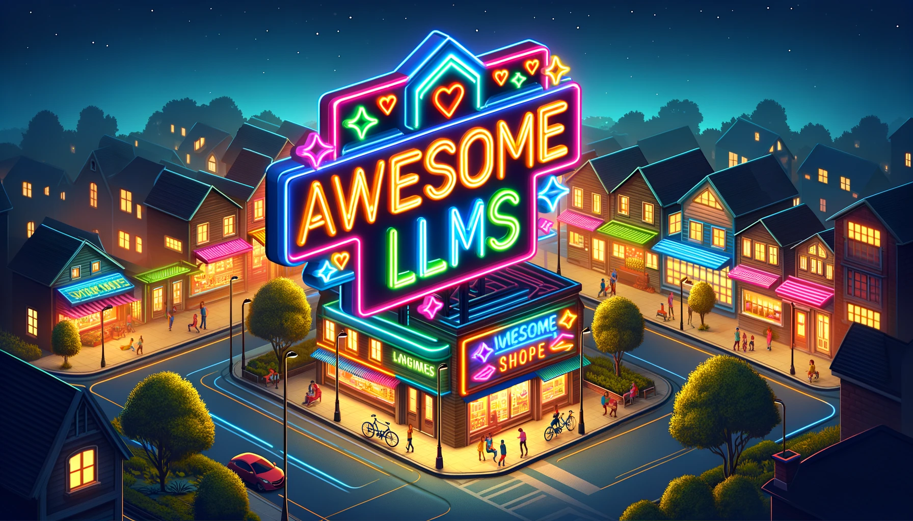

# Awesome LLMs

A samll and humble repo trying to collect *awesome* resources about Large Language Models and more!

*work in progeress...*

## Prompt Engineering

- [Prompt Engineering Guide by DAIR.AI](https://www.promptingguide.ai/)

## OpenAI's resources

- [Best practices for prompt engineering with the OpenAI API](https://help.openai.com/en/articles/6654000-best-practices-for-prompt-engineering-with-the-openai-api)
- [Knowledge in GPTs](https://help.openai.com/en/articles/8843948-knowledge-in-gpts)
- [GPT-4 Turbo in the OpenAI API](https://help.openai.com/en/articles/8555510-gpt-4-turbo-in-the-openai-api)
- [Retrieval Augmented Generation (RAG) and Semantic Search for GPTs](https://help.openai.com/en/articles/8868588-retrieval-augmented-generation-rag-and-semantic-search-for-gpts)
